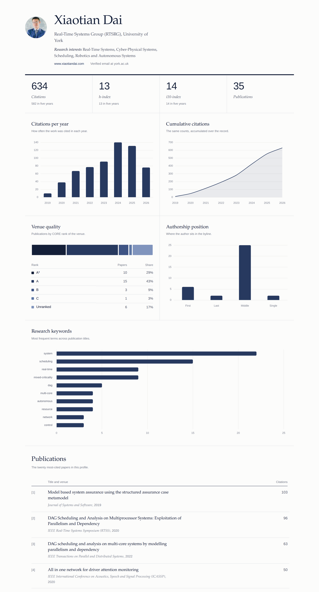

# ScholarInsights

A comprehensive toolkit for fetching, analyzing, and visualizing Google Scholar profiles. ScholarInsights provides powerful insights into academic publication metrics, venue rankings, and research trends.





## Features
- **Data Fetching**: Robust retrieval of author profiles and publication history.
- **KPI Analysis**: Calculation of total citations, yearly trends, h-index, and key research areas.
- **Authorship Analysis**: Determination of author position (First, Middle, Last, Single).
- **Publication Ranking**: Automated mapping of venues to rankings (A*, A, B, C).
- **Web Dashboard**: Interactive visualization dashboard with charts and statistics.

## Installation

1. Clone the repository:
   ```bash
   git clone https://github.com/automaticdai/ScholarInsights.git
   cd ScholarInsights
   ```

2. Install dependencies:
   ```bash
   pip install -r requirements.txt
   ```
   
   This will install:
   - `flask` - Web framework for the dashboard
   - `scholarly` - Google Scholar API wrapper
   - `requests` - HTTP library
   - `fake-useragent` - Provides rotating user-agents for web requests

## Usage


### 1. Fetching Data (`fetch_data.py`)
This script retrieves data from Google Scholar and saves it to a JSON file.

**Option A: Search by Name (Lists candidates if multiple found)**
```bash
python3 scripts/fetch_data.py --author "Xiaotian Dai"
```

**Option B: Fetch by ID (Recommended for accuracy)**
If you know the Scholar ID (found in the URL of their profile, e.g., `user=<ID>`), use it directly:
```bash
python3 scripts/fetch_data.py --id "G7dzNUkAAAAJ" --limit 100
```
*`--limit` controls the number of publications to fetch full details for (default: 10). Set high for full analysis, but beware of time/rate limits.*

**Rate Limiting (Prevents IP Bans)**

The script includes built-in rate limiting with randomized delays to avoid Google Scholar bans:
- **Default**: 2-5 second random delay between requests (recommended)
- **Configurable**: Use `--min-delay` and `--max-delay` to adjust
- **Progress tracking**: Shows estimated time remaining during fetch

```bash
# Use default delays (safest, recommended)
python3 scripts/fetch_data.py --id "G7dzNUkAAAAJ" --limit 50

# Faster fetching (higher ban risk)
python3 scripts/fetch_data.py --id "G7dzNUkAAAAJ" --limit 50 --min-delay 1.0 --max-delay 2.0

# Slower fetching (safest for large datasets)
python3 scripts/fetch_data.py --id "G7dzNUkAAAAJ" --limit 100 --min-delay 5.0 --max-delay 10.0

# Disable delays (testing only, NOT RECOMMENDED)
python3 scripts/fetch_data.py --id "G7dzNUkAAAAJ" --limit 5 --no-delay
```

**Rate Limiting Options:**
- `--min-delay SECONDS` - Minimum delay between requests (default: 2.0)
- `--max-delay SECONDS` - Maximum delay between requests (default: 5.0)
- `--no-delay` - Disable rate limiting (NOT RECOMMENDED - may cause IP ban)

**Caching**

Publication details are cached per author in `.scholar_cache/<scholar_id>.json`,
keyed by Scholar's stable `author_pub_id`. Only citation counts change between
runs, and the author listing already carries those, so a repeat fetch of a
profile costs one request and no per-publication delays. Each author has its
own cache file, so alternating between profiles never discards either one.

```bash
# First fetch of a 35-paper profile: 35 requests, several minutes
python3 scripts/fetch_data.py --id "G7dzNUkAAAAJ"

# Same profile again: 1 request, seconds — citation counts still update
python3 scripts/fetch_data.py --id "G7dzNUkAAAAJ"

# Force a full refetch (e.g. after a title or venue correction)
python3 scripts/fetch_data.py --id "G7dzNUkAAAAJ" --refresh
```

- `--cache-dir DIR` - Where per-author caches live (default: `.scholar_cache`)
- `--no-cache` - Ignore the cache entirely and do not write to it
- `--refresh` - Refetch every publication, then rewrite the cache

An interrupted run saves what it already fetched, so pressing Ctrl-C part-way
through a long fetch does not throw the work away.


### 2. Analyzing Data (`analyze_data.py`)
Generates a report from the fetched JSON data.

```bash
python3 scripts/analyze_data.py --file author_data.json
```

**Options:**
- `--file`: Path to JSON file (default: `author_data.json`)
- `--verbose-ranking`: Show intermediate results when ranking publications (venue matching and rank assignment for each paper)

**Output Includes:**
- Total Citations & Yearly Trends
- Top Research Keywords
- Authorship Position Distribution
- Publication Rankings (based on `ranking_utils.py`)

**Verbose Ranking Example:**
```bash
python3 scripts/analyze_data.py --file author_data.json --verbose-ranking
```

This will display detailed information for each publication including:
- Publication title
- Venue name (or "NOT FOUND")
- Assigned rank (A*, A, B, C, Unranked, or No Venue Found)
- Summary statistics at the end

### 3. Web Dashboard (`app.py`)
Launch an interactive web dashboard to visualize the author data.

```bash
python3 app.py
```

Then open your browser and navigate to `http://localhost:5000`

**Options:**
- `--data PATH` — path to the author data JSON (default: `author_data.json`; env `SCHOLAR_DATA`).
- `--host HOST` / `--port PORT` — bind address and port (defaults `0.0.0.0:5000`; env `HOST`/`PORT`).
- Set `FLASK_DEBUG=1` to enable debug mode (off by default).

**Dashboard Features:**
- **Profile Overview**: Author name, affiliation, research interests, and profile picture
- **Key Metrics**: Total citations, h-index, i10-index and publication count, each with its five-year figure
- **Citations per Year** and **Cumulative Citations**: paired charts sharing one x-axis, so the yearly rate and the running total can be read side by side without a second y-scale
- **Venue Quality**: publications by CORE rank on a single-hue ordinal scale, dark to light, with a table giving exact counts and shares
- **Authorship Positions**: First/Middle/Last/Single author positions
- **Research Keywords**: top terms across publication titles
- **Publications**: the twenty most-cited papers as a numbered bibliography with venues and links

The dashboard automatically loads data from `author_data.json` in the root directory.

## Configuration

- **Proxies**: `fetch_data.py` attempts to use free proxies via `scholarly`'s `FreeProxies()`. Note that with the currently pinned dependencies this fails at startup (`FreeProxy.get_proxy_list() missing 1 required positional argument: 'repeat'`) and the fetch proceeds unproxied — the publication cache, not the proxy, is what keeps request volume down. For heavier use, configure `scholarly` with a paid proxy in `setup_proxy()`.
- **Rankings**: `ranking_utils.py` loads rankings from `scripts/venue_ranks.json`.
  - To add new venues, simply edit `venue_ranks.json`.
  - Format: `"venue_name_lowercase": "RANK"` (e.g., `"rtss": "A*"`).
  
### Ranking Systems

- **Conferences**: Rankings are based on **CORE Conference Ranking** (A*, A, B, C tiers).
  - CORE is the standard ranking system for computer science conferences.
  - See: https://portal.core.edu.au/conf-ranks/
  
- **Journals**: Since CORE discontinued journal rankings in February 2022, journal rankings use alternative metrics:
  - **Impact Factor (IF)** from Journal Citation Reports (JCR)
  - **SCImago Journal Rank (SJR)**
  - **Q1/Q2 quartile classifications**
  - Rankings are assigned based on these metrics, maintaining consistency with CORE's A*/A/B/C tier system where:
    - **A***: Top-tier journals (very high impact, Q1, prestigious)
    - **A**: High-quality journals (high impact, Q1)
    - **B**: Good journals (moderate impact, Q1-Q2)
    - **C**: Reputable journals (lower impact but still recognized)

## Project Structure

```
scholarinsights/
├── app.py                      # Flask web application
├── author_data.json            # Author data (generated by fetch_data.py)
├── requirements.txt            # Python dependencies
├── README.md                   # This file
├── scripts/
│   ├── __init__.py            # Package initialization
│   ├── fetch_data.py          # Data retrieval script
│   ├── analyze_data.py        # Analysis and reporting script
│   ├── ranking_utils.py       # Ranking logic helper
│   ├── pub_cache.py           # Per-author publication cache
│   ├── venue_ranks.json      # Venue ranking database
│   └── test_fetch.py          # Test script
└── templates/
    └── index.html             # Dashboard frontend
```

## Files
- `app.py`: Flask web application serving the dashboard and API endpoints
- `scripts/fetch_data.py`: Data retrieval script for Google Scholar
- `scripts/analyze_data.py`: Analysis and reporting script with `ScholarAnalyzer` class
- `scripts/ranking_utils.py`: Ranking logic helper for venue classification
- `scripts/pub_cache.py`: Per-author publication cache that removes repeat Scholar requests
- `scripts/venue_ranks.json`: Database of venue rankings
- `templates/index.html`: Interactive dashboard frontend with Chart.js visualizations
- `author_data.json`: Generated author data file (created by `fetch_data.py`)

## API Endpoints

The Flask app provides the following endpoints:
- `GET /` - Main dashboard page
- `GET /api/data` - Raw author data JSON
- `GET /api/analysis` - Analyzed statistics and visualizations data

## License

This project is licensed under the MIT License - see the [LICENSE](LICENSE) file for details.
